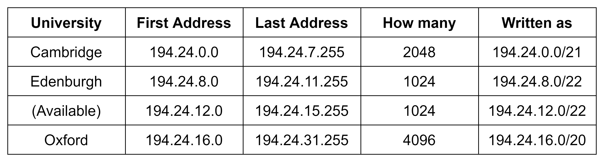

+++
title = "CIDR"
date = 2022-11-17
[taxonomies]
tags = ["Computer Network"]
[extra]
author = "JS970"
+++

# CIDR(Classless Inter Domain Routing)

- EGP(Exterior Gateway Protocol)에서 CIDR을 사용하여 IP를 분배한다.
- RFC1519에서 CIDR의 개념을 설명한다.

## Problem of IPv4 “class”

- 대부분의 경우 class A(16M)는 과하고, class C(255)는 부족하다.
- 조사에 따르면 class B의 경우도 절반 이상의 class B 네트워크의 host수가 50 미만이었다…
- “class”개념의 탈피가 필요하다.

## CIDR의 개념

- 앞서 말한 “class”때문에 IP주소의 낭비가 심각하다.
- EGP에서는 CIDR을 통해 주소를 할당하여 IP주소의 낭비를 막는다.
- CIDR을 사용하면 2의 거듭제곱(power of 2)의 단위로 IP주소의 동적 할당이 가능하다.
- 2000개의 주소를 요구한다면 2048개의 IP주소를 할당하는 식이다.
- CIDR은 bitwise prefix를 사용하여 IP주소를 식별한다. 이를 통해 IP 주소 블록을 단일 항목으로 그룹화하여 라우팅을 용이하게 한다.
    - class 기반 라우팅이 아닌 CIDR block 기반 라우팅이다.
    - CIDR block 기반 라우팅을 통해 라우팅 테이블 항목을 최소화할 수 있다.
- 같은 CIDR블록은 IP주소의 이진 표현에서 비트 단위의 초기 시퀸스가 같다.
- IPv4 CIDR구문은 IPv4와 유사한 구문을 사용한다 - XXX.YYY.ZZZ.WWW/NN
- X, Y, Z, W부분은 IP와 같이 8bit단위의 4바이트(32비트) 이진수로 해석된다.
- 슬래시 뒤쪽 부분인 NN은 주소의 왼쪽부터 카운트되는 공유된 초기 시퀸스의 개수이다.
    - 1의 개수를 의미한다.
    - /24인 경우 ⇒ 11111111.11111111.11111111.00000000

## CIDR & Routing Table Entry

- CIDR에서는 라우팅 테이블의 각 항목이 32bit mask를 사용한다.
    - 라우팅 테이블은 (IP주소, subnet mask, outgoing line)의 triple array로 구성된다.
- 라우터는 아래와 같이 동작한다.
    1. 패킷이 들어오면 대상의 IP주소가 먼저 추출된다.
    2. 그런 다음 라우팅 테이블을 항목별로 스캔하여 대상 주소를 마스킹하고, 일치하는 테이블 항목을 탐색한다.
    3. 일치하는 항목이 여러 개 있을 경우 가장 일치하는 부분이 긴 항목을 사용한다.
        
        ⇒ longest prefix match first, /20과 /24 두 개의 mask가 일치한다면 /24를 사용한다.
        

## CIDR Example

- Cambridge → Edenburgh → Oxford순으로 IP 할당을 요청했다고 가정하자
- 194.24.0.0의 시작 주소에서부터 할당을 할 수 있다고 했을 때, Cambridge는 2048개의 주소를 요청하였으므로 194.24.0.0 ~ 194.24.7.255까지의 IP를 할당할 수 있다.(256 * 8 = 2048)
- Cambridge의 Subnet Mask 계산은 아래와 같다.
    - (194.24의 경우 Network Number이므로 생략함)

- 이때 subnet mask의 1의 개수가 총 21개이므로 194.24.0.0/21과 같이 표현할 수 있다.
    - 11111111.11111111.11111000.00000000 = 255.255.248.0
- 같은 방법으로 Edenburgh의 Subnet mask를 계산하면 아래와 같다.

- Oxford의 경우 Edenburgh의 IP address를 할당한 직후 available IP 인 194.24.12.0부터 분배하면 아래와 같은 문제가 발생한다.
    
    
    
- 이때 CIDR 의 표현은 194.24.12.0/19가 되는데 이 경우 할당 가능한 IP의 개수가 32 * 256 = 8192이다. 이 경우 실제 필요한 범위 내인 4096개 보다 더 많은 IP가 할당되므로 194.24.12.0부터 Oxford에 할당할 수 없다.
    - subnet mask에서 0의 개수는 곧 할당 가능한 host의 수를 나타낸다. $2^{13}$ = 8192이므로 위와 같은 계산이 나온다.
- 따라서 Oxford에 알맞은 크기의 IP address가 할당할 수 있도록 Oxford의 First Address를 194.24.12.0이 아닌 194.24.16.0부터 할당한다.
- Oxford의 IP address 할당을 위해 사용되는 194.24.16.0~194.24.21.255의 IP와 Edenburgh가 사용하는 194.24.8.0~194.24.11.255사이의 빈 IP주소는 알맞은 크기의 할당이 필요할 때까지 남겨둔다.

### Add on

- Utilization = $busy~time/observed~time$, 100%, 50%, 25% … ⇒ no unit
- Throughput = $number~of~successful~packets / observed~time$, 10 packets / sec ⇒ unit
- 100% utilization does not garuntee good throughput!