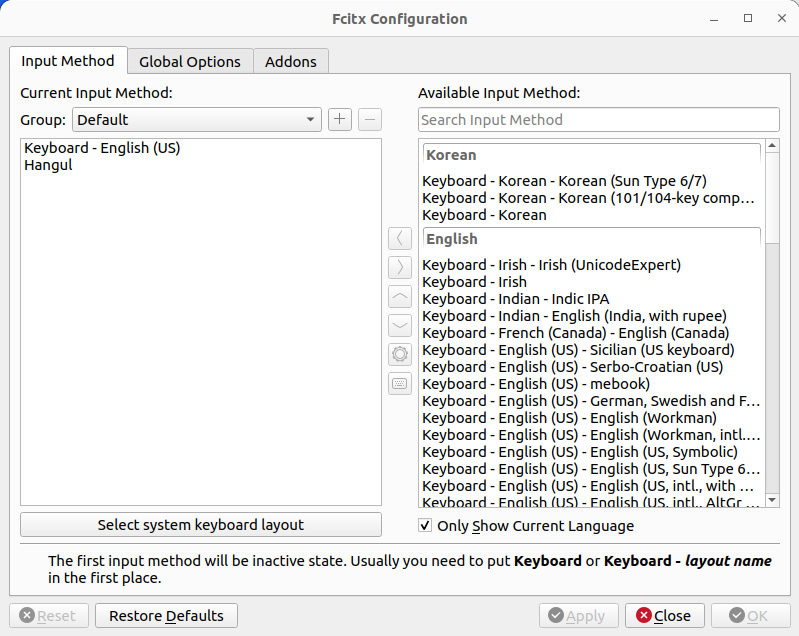
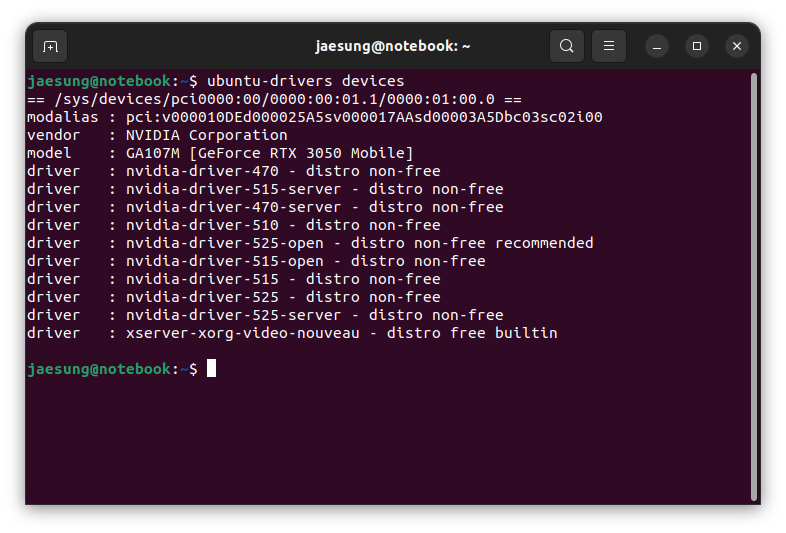

+++
title = "Ubuntu 22.04 local setting"
date = 2023-02-14
[taxonomies]
tags = ["env setting", "Ubuntu"]
categories = ["env setting"]
[extra]
author = "JS970"
+++
<aside>
💡 이미 윈도우 등 타 환경에서 우분투 ios파일로 우분투 설치 usb는 만들어서 우분투는 설치되었다고 가정한다.

</aside>

# 한/영 변환 설정

- fcitx5를 이용한다.
- ibus, uim등의 방법을 사용할 수도 있지만 이는 추후에 추가한다.(2/14/2023)

## fcitx5

- 다음 명령어를 터미널에 입력하여 fcitx5를 설치한다.

```bash
sudo apt install fcitx5
```

- 설치가 완료되면 Settings → Region & Language → Manage Installed Language에서 Keyboard input method system을 fcitx5로 변경한다.
- 위의 설정이 완료되면 컴퓨터를 재부팅한다.

```bash
sudo shutdown now
```

- 재부팅 이후 우측 상태 표시줄의 가장 왼쪽에 키보드 모양 아이콘이 추가된 것을 확인할 수 있다.


- 키보드 아이콘을 클릭한 후 configure에서 Available input Method로 Hangul을 추가한다.
    
    
    
- 이를 적용하면 ctrl+space를 통해 한/영 변환이 가능하다.

# nvidia graphic driver

- 여러 가지 설치 방법이 있지만 설치에 꽤 애를 먹었다.
- 본 글에서는 터미널에서 커맨드를 이용해 수동으로 그래픽 드라이버를 설치한다.

## 수동 설치

- 우선 아래의 커맨드를 통해 현재 사용중인 그래픽카드를 확인한다.

```bash
sudo lshw -c display
```

- 다음 커맨드를 이용하여 설치 가능한 드라이버 목록을 확인한다.

```bash
ubuntu-drivers devices
```

- 자신의 그래픽카드에 맞는 버전의 설치 가능한 드라이버를 설치한다.

```bash
sudo apt install nvidia-driver-xxx
```

- 이때 recommended가 붙어있는 nvidia-driver-525-open을 설치하려고 시도했으나 이 때문에 많은 시간을 소비했다. open버전이 아닌 버전으로 설치해야 했다.



- 드라이버의 설치가 완료되면 컴퓨터를 재부팅한다.

```bash
sudo shutdown now
```

- 마지막으로 다음 커맨드를 통해 그래픽카드 드라이버의 설치를 확인할 수 있다.

```bash
nvidia-smi
```

- 위의 커맨드를 이용하지 않고 application에서 nvidia x server를 실행하여 그래픽카드를 정상적으로 인식하는지 확인할 수 있다.

# zsh

## zsh, oh-my-zsh 설치

- mac에서 익숙하게 사용했던 zsh을 설치한다.

```bash
sudo apt-get install zsh
```

- 기본 shell을 변경한다.

```bash
chsh -s $(which zsh)
```

- curl을 이용해서 oh-my-zsh 설치(zsh 설정을 관리하는 프레임워크)

```bash
# curl설치
sudo apt isntall curl
# oh-my-zsh설치
sh -c "$(curl -fsSL https://raw.githubusercontent.com/robbyrussell/oh-my-zsh/master/tools/install.sh)"
```

- 플러그인 활성화, 쉘 설정 변경은 ~/.zshrc를 수정하여 설정 가능하다.
- 아래는 ohmyzsh의 깃허브 페이지이다.
    
    [https://github.com/ohmyzsh/ohmyzsh](https://github.com/ohmyzsh/ohmyzsh)
    

# Ref

[Ubuntu 22.04 한글 입력기 3가지 설정 방법(ibus, uim, fcitx) - 오솔길](https://osg.kr/archives/913#%ED%95%9C%EA%B8%80-%EC%9E%85%EB%A0%A5%EA%B8%B0-fcitx-%EC%84%A4%EC%B9%98-%EB%B0%8F-%EC%84%A4%EC%A0%95)

[우분투 nvidia 드라이버 설치 | 개발자 상현에 하루하루](https://hyeon.pro/dev/nvidia-drive-install-in-ubuntu/)

[Nvidia-smi outputs "No devices were found" on Ubuntu 22.04 + driver 520](https://forums.developer.nvidia.com/t/nvidia-smi-outputs-no-devices-were-found-on-ubuntu-22-04-driver-520/234829)