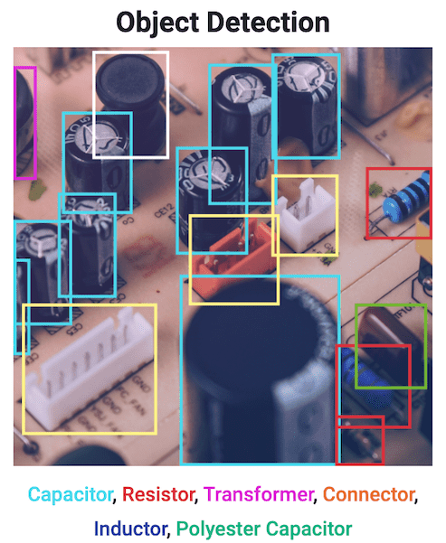

+++
title = "YOLO Quickstart"
date = 2023-01-25
[taxonomies]
tags = ["YOLO", "작성중"]
categories = ["env setting"]
[extra]
author = "JS970"
+++

# YOLO(You Look Only Once)란?

---

- 딥러닝을 이용한 Object Detection, Image Segmentation 프로그램
- Ultralytics에서 개발했다.
- 라이센스는 GPL-3.0라이센스이다. 주의할 것
    
    [yolov5/LICENSE at master · ultralytics/yolov5](https://github.com/ultralytics/yolov5/blob/master/LICENSE)
    
- 본 글은 Ultralytics YOLOv8 Docs를 기반으로 작성되었다.
    
    [Ultralytics YOLOv8 Docs](https://docs.ultralytics.com/)
    

# YOLO Quickstart

---

## Environment Requirments

[ultralytics/requirements.txt at main · ultralytics/ultralytics](https://github.com/ultralytics/ultralytics/blob/main/requirements.txt)

## Install

다음은 나의 환경에서 YOLO를 설치하는 과정을 기록한 것이다.

```powershell
pip install ultralytics
```

- 만약 dependency issue가 있다면 다 설치해서 해결해 주자
- CUDA가 설치되어 있어야 YOLO를 실행할 수 있으니 CUDA도 설치하자(YOLO가 pytorch를 사용하는데 여기에서 CUDA를 필요로 하는 것 같다.)
    - [CUDA 설치](https://developer.nvidia.com/cuda-downloads?target_os=Windows&target_arch=x86_64&target_version=10)(NAS에 CUDA_12.0.1 저장되어 있다)
    - Ubuntu 22.04에서 CUDA를 설치할 경우 다음 명령어를 한 줄씩 입력한다.
        
        ```bash
        wget https://developer.download.nvidia.com/compute/cuda/12.0.1/local_installers/cuda_12.0.1_525.85.12_linux.run
        sudo sh cuda_12.0.1_525.85.12_linux.run
        ```
        
    - 위의 명령어 입력 후 실행시킨 프로그램에서 그래픽 드라이버는 제외하고 설치해야 정상적으로 설치된다.
    - 이후 nvcc명령어를 사용해서 쿠다 버전이 확인이 되지 않는다. 이를 해결하기 위해 다음 문장을 ~/.profile의 가장 밑에 추가한다.
        
        ```bash
        export PATH=/usr/local/cuda-12.0/bin:$PATH
        export LD_LIBRARY_PATH=/usr/local/cuda-12.0/lib64:$LD_LIBRARY_PATH
        ```
        
    - 이후 source ~/.profile 명령어를 통해 변경사항을 적용시키면 아래 명령어를 통해 쿠다 버전이 정상적으로 인식되는 것을 확인할 수 있다.
        
        ```bash
        nvcc -V
        ```
        
    - [cuDNN설치](https://developer.nvidia.com/rdp/cudnn-download)(로그인 필요, CUDA12.0에 사용되는 cuDNN v8.8.0, NAS에 저장되어 있다)
        - 압축 해제 후 CUDA설치 경로(C:\Program Files\NVIDIA GPU Computing Toolkit\CUDA\v12.0\lib)의 bin, include, lib 폴더에 추가한다.
    - [Ubuntu 22.04설치](https://webnautes.tistory.com/1765)
    - Ubuntu 22.04에서 설치 시 재부팅을 해 주어야 한다.

## CLI Example

```powershell
yolo detect train model=yolov8n.pt data=coco128.yaml device=0
```

- 위의 명령어를 입력하여 간단한 예제를 수행할 수 있다.
    - pytorch가 제대로 설치되어 있지 않다면 CUDA, cuDNN이 제대로 설치되어 있어도 에러가 발생한다. [여기](https://pytorch.org/get-started/locally/)에서 환경에 맞게 다운로드 받을 수 있다.

<aside>
💡 2/12일 기준으로 이유는 모르겠지만 아래와 같은 에러가 발생하여 CLI예제 및 Python code예제를 수행하지 못하고 있다…. 해결 요망..

</aside>

## Export

- 학습 모델은 onnx확장자로 export 된다.

# Tasks

## Detection

- 객체 감지
- 이미지 또는 비디오 스트림에서 객체의 위치와 클래스를 식별하는 작업이다.
- object detector의 결과물은 이미지의 개체를 둘러싼 bounding boxes이다. 라벨, 클래스, confidence score가 각각의 박스 마다 매겨진다. 관심이 있는 장면에서 사물을 특정하기 위해 사용된다. 정확한 모양이나 위치는 특정할 수 없다.
    
    
    
- 

## Segmentation

## Classification