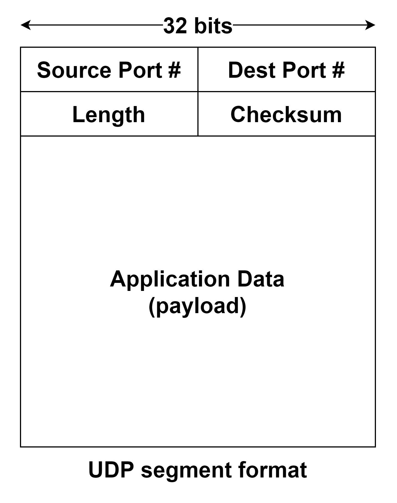

+++
title = "TCP"
date = 2022-11-22
[taxonomies]
tags = ["Computer Network"]
[extra]
author = "JS970"
+++
# Transmission Layer

- 기본적으로 네트워크 스택의 각 계층은 Independent이다.
- IP 와 TCP는 상호간의 “talk”이 존재한다. ⇒ Cross-Layer
- 지연 보장, 대역폭 보장은 지원하지 않는다.

## TCP (Transmission Control Protocol)

- Realiable, in-order(순차적인) byte-stream delivery
- process to process → 라우터는 TCP를 사용하지 않는다.
- Congestion control 지원(sender)
- Flow control 지원(receiver)

## UDP (User Datagram Protocol)

- 사용자 데이터그램 프로토콜 - 데이터를 데이터그램 단위로 처리함
    - 데이터그램 : 독립적인 관계를 지니는 패킷
    - 각각의 패킷은 서로 다른 라우팅 경로를 통해 전송됨
- Unreliable, unordered delivery
- IP의 “best effort”의 확장

- UDP segment의 Length부분은 헤더의 길이를 포함한다.
- UDP의 특징
    - no connection establishment (connection establishment는 지연을 유발함)
    - simple : no connection state at sender, receiver
    - 헤더 크기가 작다
    - congestion control이 없다 : 원하는 만큼 빠르게 동작할 수 있다.
    - UDP checksum ⇒ IP에서의 checksum과 동일하게 계산된다.
        - 16비트 단위의 sum, carry발생 시 + 1

# TCP

- Connection 의 설정/종료
    - 3-way handshaking을 통해 Connection Establishment가 이뤄진다.
    - 4-way handshaking을 통해 Connection Termination이 이뤄진다.
- Stop and Wait
- Sliding Window
    - smart reciever
    - dumb sender
- Flow Control
    - Flow control은 sender가 receiver의 허용되는 버퍼 용량 이상으로 overrunning하는 것을 방지한다.
    - end-to-end issue이다.
- Adaptive Timeout
    - 서버와 클라이언트 사이의 데이터 교환이 없을 경우 일반적으로 2시간의 Timeout을 가지고 disconnect된다.(설정가능)
- Congestion Control
    - Congestion Control(혼잡 방지)은 네트워크를 통해 너무 많은 데이터가 전송되어 스위치 또는 링크에 과부하가 걸리는 것을 방지한다.
    - IPv6의 경우 ECN(Explicit Congestion Notification)이 존재한다.
    - 이를 통해 라우터가 congestion의 존재를 알 수 있다.
        - packet arrival rate > service rate인 경우
    - IPv4에서는 RTT(Round Trip Time)를 통해 “추측” 할 뿐이다.
- TCP에는 7개의 타이머가 있다. 이를 이용해서 reliable connection을 보장한다.
    - retransmission timer, persistant timer, keep alive timer … (총 7개)

## Transport services and protocols

- 서로 다른 호스트에서 실행되는 어플리케이션 프로세스 간의 논리적 통신 제공
- Transport system은 end systems 간에 실행된다.
- 송신 측 : 어플리케이션 계층의 앱 메시지를 세그먼트 단위로 분할하고 네트워크 계층으로 전달한다.
- 수신 측 : 세그먼트를 메시지로 재구성한다. 이를 어플리케이션 계층으로 전달한다.
- 어플리케이션 계층에서는 하나 이상의 전송 프로토콜을 사용 가능한다.
    - Internet : TCP & UDP

## Transport Layer vs Network Layer

### Transport Layer

- 프로세스 간의 통신
- 네트워크 계층에 의존하며, 네트워크 계층을 강화한다(?).

### Network Layer

- host간의 통신

## TCP segment Structure

- Wireshark TCP 과제 참고할 것

### src, dest port

- 송신지 및 수신지 포트 번호

### sequence number, acknowledgement number

- 세그먼트 단위가 아닌 바이트 단위로 카운팅한다.
- sequence number는 TCP segment의 연속된 데이터 번호이다. 전송되는 세그먼트의 가장 앞에 있는 숫자를 표기한다.
    - 패킷이 1000 ~ 1150까지의 TCP 세그먼트 데이터를 전송한다면 sequence number는 1000이다. 다음 sequence number는 1151이다.
    - acknowledgement number(ACK #)는 상대방으로부터 받아야하는 다음 TCP 세그먼트의 데이터 번호
    - acknowledgement number는 $0$ ~ $2^{32}-1$의 값을 가질 수 있다. 이때 대역폭에 따라 ACK의 warp around time을 구할 수 있다.
        - T1(1.5Mbps의 대역폭)의 경우 $2^{32}-1 / 1.5*2^{6} = 6.4hours$의 ACK warp aroound time을 가진다.
        - STS-24(1.2Gbps의 대역폭)의 경우 $2^{32}-1 / 1.2*2^{9} = 28second$의 ACK warp around time을 가진다.

### head length(data offset), not used(reserved)

- TCP 헤더의 길이를 나타낸다.
- 최소 크기는 5word(20byte)이고, 최대 크기는 15word(60byte)이다.
    - 1word = 4byte
- not used부분은 future use를 위해 남겨두는 부분이며 0으로 설정된다.

### U(URG)

- Urgent point field의 significant를 가리킨다.

### A(ACK)

- ACK field의 significant를 가리킨다. 클라이언트에서 보낸 초기 SYN패킷 이후의 모든 패킷에는 이 플래그가 set 된다.

### P(PSH)

- Push function이다. buffered data를 receiving application으로 push 할지를 결정한다.
    - 버퍼에 들어오자마자 push…?

### R(RST)

- Reset the connection

### S(SYN)

- sequence number를 동기화한다. 서버 및 클라이언트에서 송신한 첫 번째 패킷에서만 이 flag를 사용한다.

### F(FIN)

- sender의 마지막 패킷을 가리킨다.

## TCP Establishment, Termination and retransmission scenarios

### TCP Establishment

- TCP Establishment는 3-way handshaing으로 이뤄진다.
- Sequence Number는 random number로 설정된다(항상 0부터 시작되는 것이 아님)
- Sequence Number는 byte stream의 번호이다.
- Acknowledge Number는 반대쪽에서 전송행야 할 다음 byte를 말한다.
- 순서가 뒤죽박죽인 segment를 정렬하는 것 ⇒ TCP구현의 문제이다.

### TCP Termination

- Client 와 Server모두 Terminate를 시작할 수 있다.
- Client가 Terminate를 시작한다고 했을 때의 시나리오는 아래와 같다.
    - Client가 TCP FIN 패킷을 전송한다.
    - Server가 TCP FIN 패킷에 대한 ACK를 전송한다.
    - Client는 이후 Server로부터의 FIN 패킷 수신을 대기한다.
    - Server가 전송한 FIN 패킷을 수신하면 Client는 Server로 ACK패킷을 전송한다.
- 위와 같은 4-way handshaking으로 TCP Terminate가 이뤄진다.

### TCP retransmission scenarios

- Host A에서 전송한 패킷에 대한 Host B의 ACK가 loss된 경우이다.

- Timeout 이내에 ACK를 수신하지 못했을 경우, 아래 그림과 같이 Host A는 ACK를 받지 못한 패킷을 Host B로 재전송한다.

- Host B로부터의 ACK가 Timeout이후에 Host A로 도달하는 경우이다.
- Host A는 Timeout내에 ACK를 수신하지 못했으므로 Segment #92부터 시작하는 패킷을 재전송한다.
- 하지만 Host B는 이미 #119까지의 데이터를 모두 수신한 상태이기 때문에 Host A에게 Segment #120을 요구하는 ACK를 전송한다.
- 아래 경우는 Timeout 이내에서 ACK 100이 loss되었으나 ACK 120은 정상적으로 전송된 경우이다.

- Cumulative ACK scenario에 의해 ACK 100이 loss되어도 ACK 120이 Timeout내에 전송되면 Don’t care이다.
- 이를 통해 Dumb Sender & Smart Receiver를 확인할 수 있다.
    - receiver측에서 패킷이 연속적으로 존재하는 것을 확인했으므로 ACK 120을 전송
    - sender는 ACK의 요구대로 전송

## TCP State Diagram
출처 : [https://ssup2.github.io/theory_analysis/TCP_Connection_State/](https://ssup2.github.io/theory_analysis/TCP_Connection_State/)

### TCP Client lifecycle

### TCP Server lifecycle

- LISTEN state에서 passive participant(server)의 local process가 send operation을 호출하면 SYN_SENT상태로 전이하기도 한다. 이는 마치 active connection establishment처럼 보인다.

### TCP  connection terminating

- ESTABLISHED 상태에서 CLOSED상태로 전이하는 세 가지 조합이 존재한다.
- Active Closer : 먼저 close() 하는 Host
- Passive Closer : FIN을 수신하고 이후에 close하는 Host
1. Active Closer
    - ESTABLISHED → FIN_WAIT→ FIN_WAIT_2 → TIME_WAIT → CLOSED
        1. Active Closer가 FIN을 전송하고 FIN_WAIT_1로 전이한다.
        2. Passive Closer로부터 ACK를 수신하고 FIN_WAIT_2로 전이한다.
        3. Passive Closer로부터 FIN을 수신하고 TIME_WAIT로 전이한다.
        4. 2MSL(Maximum Segment Lifetime)만큼 TIME_WAIT가 유지된 후 CLOSED로 전이한다.
2. Passive Closer
    - ESTABLISHED → CLOSE_WAIT → LAST_ACK → CLOSED
        1. CLOSE_WAIT 상태는 Passive Closer가 Active Closer로부터 FIN을 수신하고 전이하는 상태이다.
        2. Passive Closer가 close() System Call을 호출하거나 Passive Closer의 Process가 종료되면 Passive Closer는 FIN을 전송하고 LAST_ACK상태가 된다.
        3. CLOSE_WAIT상태의 Passive Closer가 FIN을 전송한 후 이에 대한 ACK를 전송받기 전까지의 상태이다.
        4. ACK를 수신하고 CLOSED로 전이한다.
3. 동시에 close하는 경우(둘다 Active Closer)
    - ESTABLISHED → FIN_WAIT_1 → CLOSING → TIME_WAIT → CLOSED
        1. simultaneous closes가 발생하여 FIN_WAIT_1상태의 두 Active Closer가 FIN을 수신한다.
        2. 이 경우 두 Active Closer들은 FIN_WAIT_1에서 CLOSING 상태로 전이한다.
        3. 다른 Host로부터 ACK를 전송받고 TIME_WAIT로 전이한다.
        4. TIME_WAIT에서 2MSL만큼 대기한 후 CLOSED로 전이한다.

### Why TIME_WAIT?

- TIME_WAIT 상태에서는 2 Maximum Segment  Lifetime만큼 TIME_WAIT가 유지된다.
- Maximum Segment Lifetime은 개념적으로 end point간의 round trip에 걸리는 시간이다.
- 1MSL은 보통 1분 ~ 4분 정도이다.
- TCP의 전이중 연결(full-duplex connection)이 reliable하게 종료되도록 하기 위해 TIME_WAIT가 필요하다.
- 네트워크 상에서 종료된 Connection관련 Segment들이 완전히 제거 될때까지 대기하여 이후에 생성되는 새로운 Connection에 영향을 미치지 않도록 하기 위해 필요하다.

## TCP Error Control

### Stop-and-Wait ARQ

- 이 방법에서는 전송 데이터의 복사본을 유지하고 있다가 타이머가 만료되면 재전송한다.
- Wi-Fi등에서 사용된다.
- Stop-and-Wait에서는 frame의 numbering을 위해 sequence number를 사용한다.
- sequence number는 modulo-2공간에 기반한다.
    
    
    
    
    
- Stop-and-Wait에서는 다음 frame number의 modulo-2연산한 값을 acknowledgement number로 사용한다.
- Stop-and-Wait의 Flow Diagram은 아래와 같다.
    
    
    
- Bandwidth-delay product
    - Bandwidth * Delay = round trip당 최대 전송 가능한 크기
    - 1Mbps의 대역폭을 가지는 통신에서 round trip delay 가 20ms 라고 하자
        - $(1*10^6) * (20 * 10^{-3}) = 20000$
        - 즉, 20ms안에 최대 20000bit의 전송이 가능하다.
        - 이때 frame의 크기가 1000bit라고 하면 $utilization = 1000 / 20000 = 5 \%$ 이다.
        - 이처럼 Stop-and-Wait방식에서는 대역폭이 크거나 frame의 크기가 작다면 대역폭을 낭비가 심하다.
        - 주로 Wi-Fi등의 noise가 심한 통신 방법에서 사용한다.

### Go - Back - N ARQ

- Segment #5, Segment #6이 수신되었지만 #3, #4가 제대로 수신되지 않았다.
- reveiver에서는 ACK 3을 전송하였으나 #5, #6을 수신한 꼴이 된다. → ACK 3을 각각의 Segment에 대해 전송할 것이다.
- 위의 그림에서는 재전송된 ACK 3이 도착하기 전에 Host A의 Timeout이 경과하여 ACK를 수신하지 못한 Host A가 수신하지 못한 첫 번째 ACK인 Segment #2(ACK 3이 수신되어야 했다)로 되돌아가 Segment를 재전송한다. (Go - Back - N)
- Go-Back-N방법에서는 sequence number는 modulo $2^m$공간 안에 존재한다.
- Send window size는 최대 $2^m-1$의 크기를 가진다.
    - $2^m$의 크기를 가지게 되면 모든 ACK가 loss되었을 때 다음번 수신된 Frame이 정상적으로 인식되는 문제가 있다.
    - 위의 경우 경우 실제로 전송된 정보는 sender window가 sliding되지 않았으므로 sender window에서 이전에 전송한 Frame이 재전송된다.
- Go-Back-N은 이미 성공적으로 전송된 프레임이 있다고 하더라도 이전에 와야 할 프레임이 제대로 전송되지 않았다면 전송에 실패한 프레임부터 차례대로 재전송해야 한다. ⇒optimal 하지 않음
    
    
    
- Stop-and-Wait는 Go-Back-N에서 send window의 크기가1인 특수한 경우로 생각할 수 있다.

### Selective Repeat ARQ

- sender 및 receiver의 window size는 $2^{(sequence\ number\ field\ in \ bits)-1}$이하의 크기를 가질 수 있다.
- sender측에서는 Go-Back-N과 동일하게 sender window의 모든 값들을 ACK없이 전송 가능하다.
- receiver에서는 수신한 Frame에 대해서 검사하고 ACK를 전송한다, 전달받은 Frame에 대해서 receiver window를 slide한다.
- 하지만 receiver window에서 전송받지 못한 Frame이 있다면 이에 대해 NAK를 전송한다. 이후 전송받은 Frame에 대해서는 버퍼에서 유지하고 있는다.
- NAK에 대해 정상적으로 재전송이 이루어졌다면 receiver window를 slide한다.
- 아래 그림은 sender window 및 receiver window의 크기가 4인 경우에 대한 selective reaeat scenario이다.
    - 왼쪽 그림은 ACK loss가 발생했을 때의 동작이고, 오른쪽 그림은 Frame loss가 발생했을 때의 동작이다.

## TCP Flow Control

- Receiver에 의해 flow control 이 이뤄진다.
- TCP header의 AdvertisedWindow를 이용하여 receiver가 사용 가능한 buffer공간을 sender에게 전송한다.
- Receicver 버퍼의 오버플로우를 막기 위해 아래를 만족해야 한다.
    
    LastByteRcvd-LastByteRead ≤ Sizeof(MaxRcvBuffer)
    
    
    
- 정확한 AdvertisedWindow의 값의 계산은 아래와 같다.
    - AdvertisedWindow = MaxRcvBuffer - {(NextByteExpected - 1) - LastByteRead - {the amount of out-of-order data received since the NextByteExpected Sequence Number)}
- Receiver process에서 무거운 작업을 처리하는 등의 이유로 Read가 지연되면 자연히 AdvertisedWindow의 크기는 줄어들게 되며, 결국은 0으로 수렴할 것이다.
    
    ⇒ Slow Receiving process는 결국 빠른 sending process를 멈추게 될 것이다.
    

# reference

[[TCP/UDP] TCP와 UDP의 특징과 차이](https://mangkyu.tistory.com/15)

[TCP Connection State](https://ssup2.github.io/theory_analysis/TCP_Connection_State/)

[TCP connection status](https://www.ibm.com/docs/en/zos/2.1.0?topic=SSLTBW_2.1.0/com.ibm.zos.v2r1.halu101/constatus.html)

[[네트워크프로토콜] 흐름제어, 에러제어](https://vicente-blog.com/blog/66/)

[Window Size란?](https://mslilsunshine.tistory.com/102)